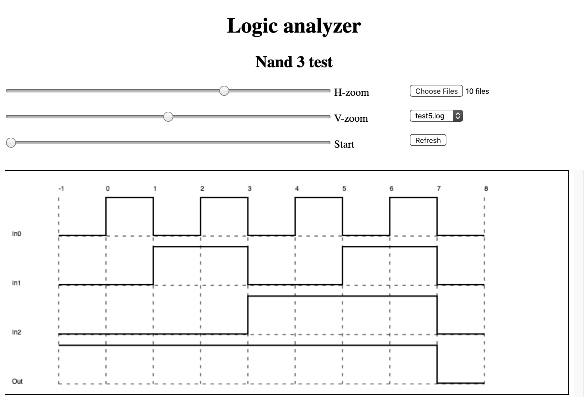

# DCS
## Digital circuit simulator - from logic gates up

Inspired by the work of [Ben Eater](https://www.youtube.com/watch?v=HyznrdDSSGM&list=PLowKtXNTBypGqImE405J2565dvjafglHU) and not having the possibility to follow his work with hardware, I have decided to write a circuit simulator and build on top of it a processor. I am trying to take into account the time dependency of the system evolution. However, in real hardware, the state change of every component depends on many factors such as the technology in use, noise, imperfections, and so on. It would be out of the scope of this project trying to simulate all these factors. As a good compromise, I define the unit delay `tau` as the maximum delay that any of the elementary logic gates (and, or, not, nand, nor, etc.) can exhibit. Time diagrams and constraints are based on the value of `tau` which, can be seen as a free parameter whose value cannot be established a priori. Time itself is therefore discretized in steps of length `tau`.

Examples of how to use the component library are located in `./scr/Tests` folder.

## How to build (Mac and Linux)
You are welcome to build the project the way you prefer. However, you can also use the tool provided here.
### Generate a Makefile file
Run

```
bin/makeMakefile.sh
```
This script must be run every time you add, move, or remove a .cpp or .hpp project file.
### Build and run

```
make [OPT=<x>] [OUT=<executable_file_name>]
```

`<x> = 0, 1, 2, or 3` is the optimization level. ```OPT``` not specified is equivalent to ```OPT=0```

`executable_file_name` is the name of the executable file, which will be placed in the `./build` folder and saved with the suffix `-<x>`. The default name is `out`.

The compiled object files will be located in `./build/objects`.

To erase the `./build` folder, run

```
make clean
```

#### Example:
There exist several ways to build. The simplest are as follows
```
make					# produces ./build/out-0
make OPT=2 OUT=test		# produces ./build/test-2 with optimization level 2
```
In addition, you can choose to build and run using

```
bin/build-run.sh [<TEST_NUMBER>]              # build and run <TEST_NUMBER>
bin/build-run-save.sh [<TEST_NUMBER>]         # build and run and save the output of <TEST_NUMBER>
```

If `<TEST_NUMBER>` (=0, 1, ... N) is specified, the corresponding test will be run righ after compilation. Chech `src/main.cpp` to see the list of tests available. If N is not specified, the default test is run.

The output is saved in `./gui/assets`. 

To specify the desired optimization level (by default equal to 0), the above instructions can be executed while <u>adding a second parameter between 0 and 3</u>. For instance

```
bin/build-run-save.sh 3 2

```
will build and run test number 3 with optimization level 2.
#### Known issue
```
make OUT=name OPT=0 # ok
make OUT=name OPT=1 # ok
make OUT=name OPT=0 # will override ./build/name-0 without recompiling the object files
```
##### Workaround: don't do that! (or run `make clean` first)

## How to display the data
A small web application can be found in the `./gui/` folder. At the time of writing, the interface looks as shown in the following figure
<!--[]-->

To load one or more file, open the `./gui/assets/` folder and select one or more files from there. Those files are generated when running the script `build-run-save.sh` or `clean-build-run-save.sh`, located in the `./bin/` folder. If you don't have any, you can find some samples in `./gui/assets/samples/`.

The gui allows to

- select the desired file from the dropdown menu
- set the horizontal and vertical stretching factors
- scroll left-right by using the `Start` slider (swiping left right is disabled to avoid undesired page swiping)
- scroll up-down by using the regular mouse wheel or trackpad
- refresh the image without refreshing the page by clicking on `Refresh` - very useful if you re-build and want to see the updated result from the same file.